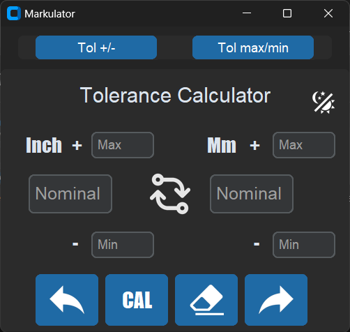
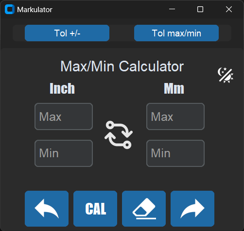
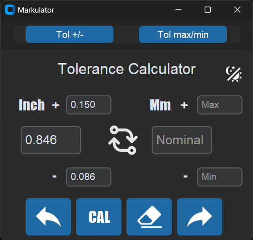
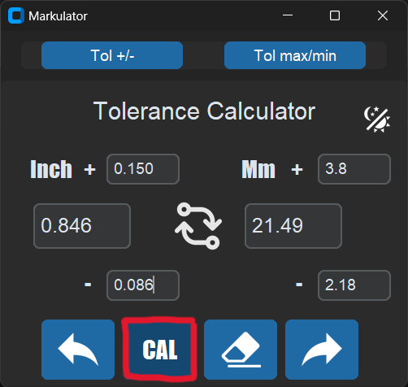
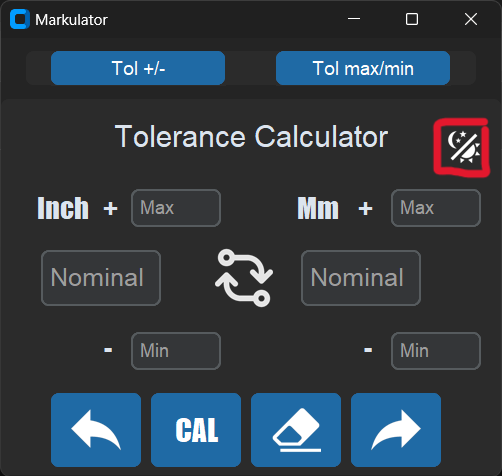
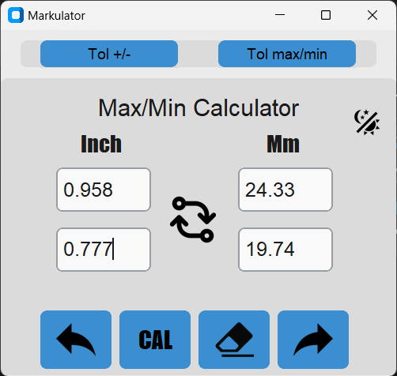

# 📐 Markulator — Tolerance Calculator

<div align="center">
  
  
  
  
  
  
  
  
</div>

<div align="center">
  <p><strong>A compact desktop calculator for inch-to-millimeter tolerance conversion, rounded output, and fast engineering/machining workflows.</strong></p>
  <p>
    <a href="https://github.com/Dovshmi/Markulator/releases/latest"><strong>Download Latest Release</strong></a>
    ·
    <a href="https://github.com/Dovshmi/Markulator"><strong>GitHub Repository</strong></a>
  </p>
</div>

---

## Overview

**Markulator** is a Python desktop application for calculating tolerance values between inches and millimeters. It is designed for users who work with precise measurements, especially engineering, machining, manufacturing, and workshop-style tasks where quick tolerance conversion matters.

The app provides a clean CustomTkinter interface, two calculation modes, light/dark theme handling, memory navigation for previous calculations, and Windows executable packaging through PyInstaller.

---

## Product Goals

- Convert inch-based values into millimeter outputs quickly.
- Show nominal, maximum, and minimum tolerance values clearly.
- Support two practical workflows: nominal ± tolerance and direct max/min tolerance entry.
- Keep the UI simple enough for repeated daily use.
- Package the app as a Windows desktop executable for non-technical users.

---

## Core Features

### Calculation Modes

- **Tolerance +/- mode** — enter a nominal inch value plus max/min inch tolerance values and receive millimeter outputs.
- **Tol max/min mode** — enter direct max/min inch tolerance values and convert them into millimeters.
- **Inch to millimeter conversion** using the standard `1 inch = 25.4 mm` conversion rule.
- **Two-decimal display** for readable output in day-to-day measurement work.
- **Deviation checks** to adjust rounding behavior where simple rounding may produce a tolerance edge issue.

### Desktop Experience

- **CustomTkinter UI** with a compact 400x350 desktop layout.
- **Light/dark theme switching** with automatic system-theme detection through `darkdetect`.
- **Memory navigation** for moving backward and forward through previous calculations.
- **Clear/reset actions** for fast repeated input.
- **Enter-key calculation support** for a faster keyboard-driven workflow.
- **Icon/image assets** loaded from the `pictures/` directory.

---

## Screenshots

<div align="center">
  
  
</div>

<div align="center">
  
  
</div>

<div align="center">
  
  
</div>

---

## Tech Stack

| Area | Technology |
| :--- | :--- |
| Language | Python 3.x |
| GUI | CustomTkinter |
| Image Handling | Pillow (`PIL`) |
| Theme Detection | darkdetect |
| Packaging | PyInstaller |
| Target Platform | Windows desktop |
| License | GPL-3.0 |

---

## Project Structure

```text
Markulator/
├── .github/
│   └── workflows/              # GitHub workflow files
├── Screenshots/                # README screenshots and UI examples
├── dist/                       # Built executable / installer artifacts
├── pictures/                   # Icons and UI image assets
├── .gitignore
├── LICENSE                     # GPL-3.0 license
├── Markulator.py               # CLI / calculation-focused prototype
├── Marlulator_app.py           # Main CustomTkinter desktop app
└── README.md
```

> Note: the current GUI entry file is named `Marlulator_app.py` in the repository. Keep that filename in commands unless you rename the file in the codebase.

---

## Getting Started

### Prerequisites

Install Python 3 and make sure `pip` is available.

```bash
python --version
pip --version
```

### 1. Clone the repository

```bash
git clone https://github.com/Dovshmi/Markulator.git
cd Markulator
```

### 2. Install dependencies

```bash
pip install customtkinter pillow darkdetect
```

For building a standalone executable, also install PyInstaller:

```bash
pip install pyinstaller
```

### 3. Run the desktop app

```bash
python Marlulator_app.py
```

### 4. Optional: run the console calculator

```bash
python Markulator.py
```

---

## Build a Windows Executable

Use PyInstaller from the project root:

```bash
pyinstaller --onefile --noconsole --icon=pictures/calc.ico .\Marlulator_app.py
```

The generated executable will be created inside:

```text
dist/
```

Recommended release workflow:

1. Test the app by running `python Marlulator_app.py`.
2. Build with PyInstaller.
3. Open the generated `.exe` from `dist/`.
4. Confirm icons and images load correctly.
5. Upload the final installer or executable to GitHub Releases.

---

## Usage Guide

### Tolerance +/- Mode

1. Open the app.
2. Select **Tol +/-**.
3. Enter the nominal inch value.
4. Enter the maximum and minimum inch tolerance values.
5. Press **CAL** or hit **Enter**.
6. Read the nominal millimeter value and upper/lower tolerance outputs.

### Tol max/min Mode

1. Select **Tol max/min**.
2. Enter the max/min inch values directly.
3. Press **CAL** or hit **Enter**.
4. Review the converted millimeter values.

### Memory Navigation

- Use the back arrow to review older calculations.
- Use the forward arrow to move back toward the newest calculation.
- Use clear/reset to remove the current inputs and outputs.

---

## Precision Notes

Markulator displays results using two decimal places. This keeps the interface readable and practical for quick tolerance checks.

The app also includes deviation checks around rounded and non-rounded values so the displayed tolerance boundaries do not accidentally drift in the wrong direction after rounding.

For production-critical engineering, machining, inspection, or safety-sensitive work, verify results against your approved measurement standard, drawing requirement, or certified calculation process.

---

## Download

The preferred download location is GitHub Releases:

```text
https://github.com/Dovshmi/Markulator/releases/latest
```

A legacy external download link may also exist in older documentation, but GitHub Releases is the cleaner long-term place for installers and versioned builds.

---

## Development Notes

- `math` is part of the Python standard library and does not need to be installed with `pip`.
- The image library should be installed as `pillow`, even though the import name is `PIL`.
- Keep `pictures/` paths stable because the GUI loads icons directly from that folder.
- Test both light and dark mode after changing UI assets.
- Avoid committing unnecessary large build artifacts unless they are intentionally part of a release workflow.

---

## Future Improvements

- Add a `requirements.txt` file for one-command dependency installation.
- Add input validation for empty or invalid numeric fields.
- Add a dedicated error message instead of console output for invalid input.
- Add automated tests for conversion and rounding logic.
- Add a clean installer workflow through GitHub Actions.
- Rename `Marlulator_app.py` to `Markulator_app.py` and update build commands accordingly.

---

## License

This project is licensed under the **GNU General Public License v3.0**. See [`LICENSE`](LICENSE) for details.

---

<div align="center">
  Built by <strong>Rony Shmidov</strong><br />
  A focused desktop tool for practical tolerance conversion.
</div>
