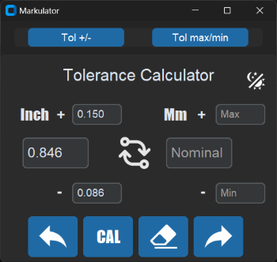
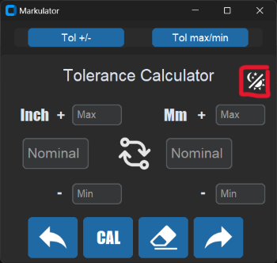

## Markulator: A Tolerance Calculator in Python

**Markulator** is a Python application that helps you calculate the nominal and tolerance values for both inches and millimeters. It features a user-friendly interface and powerful functionality, making it ideal for engineers, machinists, and anyone who works with precise measurements.

    

### Features:

* **Dual-mode calculation:** Choose between calculating tolerance values based on a nominal inch and tolerance range, or directly setting the desired maximum and minimum tolerances in millimeters.
* **Memory recall:** Review past calculations with a handy back and forward navigation system.
* **Theme switching:** Adapt the interface to your preference with light and dark themes.
* **Clear and concise output:** View the nominal millimeter value, as well as the upper and lower tolerance limits in both millimeters and inches.
* **Intuitive interface:** Customtkinter widgets provide a visually appealing and easy-to-use experience.

### Precision:
The Markulator application is designed to maintain precision in calculations. All floating-point calculations are performed with a precision of two decimal places. This means that the results displayed, including nominal values and tolerance limits, will show two numbers after the decimal point. This level of precision ensures accurate and reliable calculations for your engineering and measurement needs.

For example:
- If the nominal value is calculated as 10.567, Markulator will display it as 10.57.
- Tolerance limits, upper and lower, will also be presented with two decimal places for enhanced clarity and accuracy.

This commitment to precision is intended to provide users with confidence in the accuracy of the calculated values.

### Getting Started

**Option 1: Set Up with PyInstaller (recommended for advanced users)**

1. Ensure you have Python 3.x and `pip` installed.
2. Install the required libraries:

```
pip install customtkinter math PIL darkdetect
```

3. Open a terminal in the project directory and run:

```
pyinstaller --onefile --noconsole --icon=pictures/calc.ico .\Marlulator_app.py
```

This will create an executable file named `markulator.exe` in the `dist` folder.

**Option 2: Use the Pre-built Setup Wizard (recommended for beginners)**

1. Extract the contents of the `dist` folder to any location on your computer.
2. Run the `markulator-setup.exe` file.
3. Follow the on-screen instructions to install the necessary libraries and create a shortcut on your desktop.

**Using Markulator:**

1. Launch the application (either the executable or the shortcut).
2. Choose the desired calculation mode:
    * **Tolerance +/-:** Enter the nominal inch value and desired tolerance range (plus and minus).
    * **Tol max/min:** Directly set the maximum and minimum tolerances in millimeters.
3. Click the "CAL" button to calculate the results.
4. The nominal millimeter value, upper and lower tolerance limits in both millimeters and inches, will be displayed.
5. Use the navigation buttons to review past calculations or clear the current entry.

   

 

### Additional Notes:

* The application automatically detects the system theme and adjusts accordingly. 
* You can switch between themes manually using the theme button.
* The application uses darkdetect to automatically adjust the theme on startup based on your system's dark mode settings.
* The `dist` folder also contains the Python source code and other project files, if you prefer to explore or modify the code yourself.


 


**Feel free to contact the developer for any feedback or suggestions.**

### Thank you for using Markulator! We hope it simplifies your tolerance calculations and makes your work more efficient.
Link to download from MegaUpload
https://mega.nz/file/s4cRGDTI#Xf-WX6y9wFVHQaxAtwLSI_j__TQ-joBsYIFSK4u7yAw
### By Rony Shmidov
